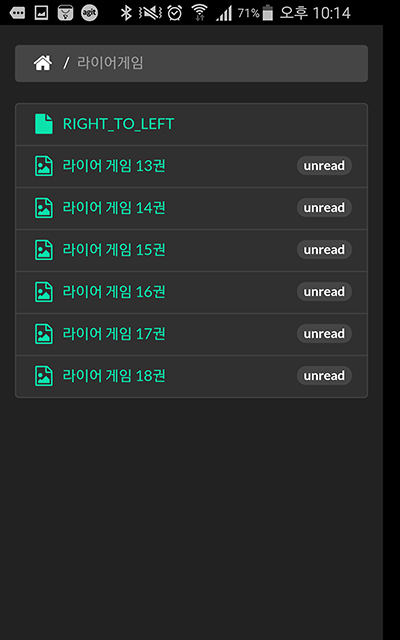

# before_sleep
Comics ZIP file web viewer service.

## I want
* to read my image zip files on iPhone and Android without an extraction in my bed.
* to store zip files into my RaspberryPI in my home-network.
* to make them easier.

## So It
* is a Web-App.
* saves my history on HTML5 localStorage.
* is powered by perl(mojolicious) for RaspberryPI(archlinux).

## Install it and run.

```bash
$ # check out this project and get in.
$ cat cpanfile | cpanm
$ morbo -l 'http://*:3000' ./bs.pl
....
```

and Enjoy!

## Screen Shots

### Explorer




* Put your zip files into ./data directory.
* If the images are for right to left reading, put a file named 'RIGHT_TO_LEFT' or 'RTL' into same directory.

### Viewer


* You can flip a next/prev page by clicking in each 30% position from left/right.

### Navigator


* You can open a navigator by clicking center.
